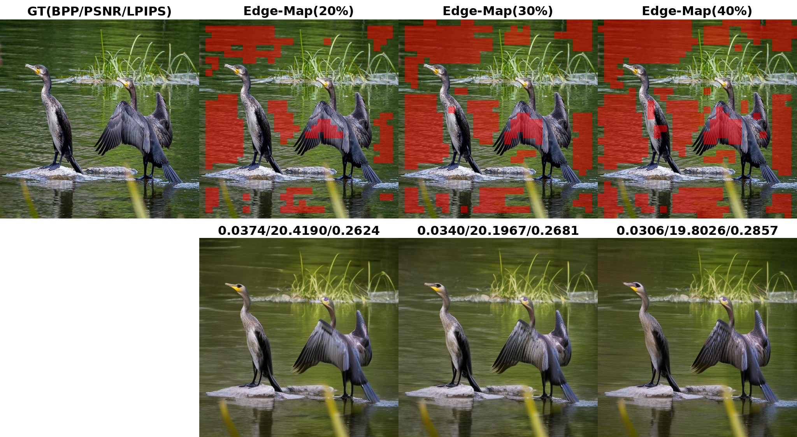
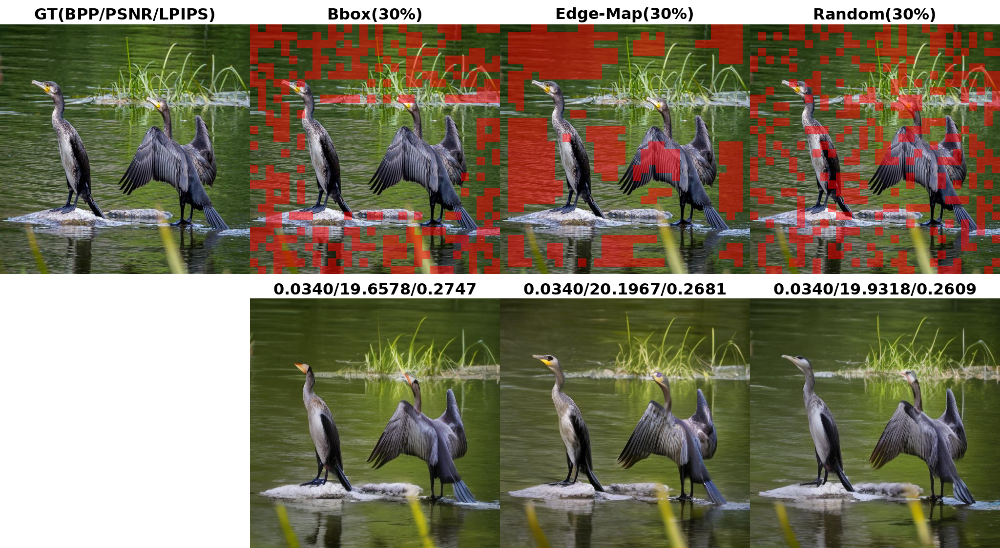
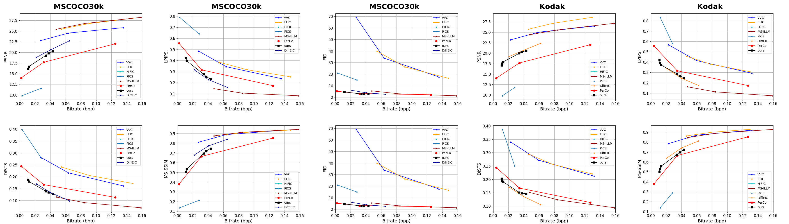

# Decouple Distortion from Perception: Region Adaptive Diffusion for Extreme-low Bitrate Perception Image Compression

#### <a name="intro">:rocket: This repository is the official implementation of Residual Denoising Diffusion Models.

## :sunny: Overview

## :memo: TODO
- [ ] Release code
- [ ] Release pretrained models

## :eyes: Visualization results

     

     

## :crossed_swords: Quantitative Performance

     

